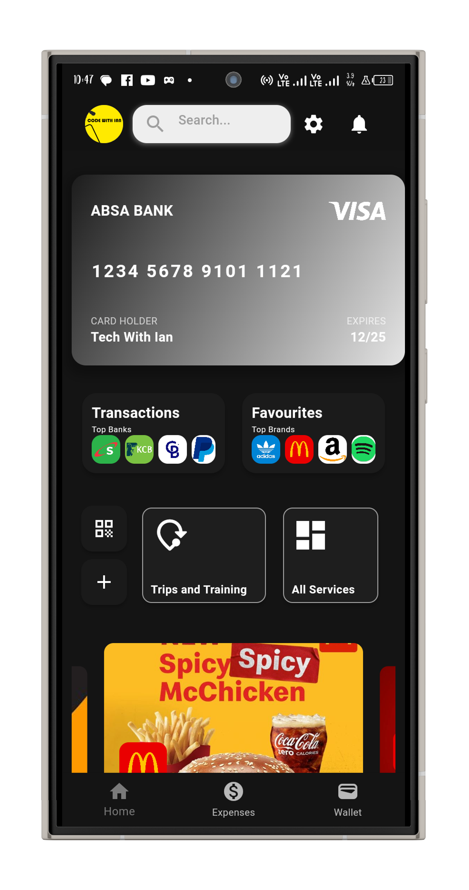
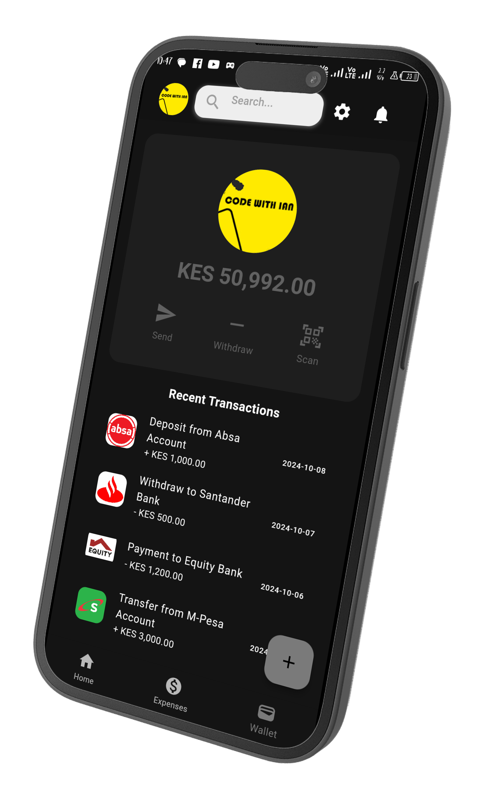

# Wallet App

A modern Flutter-based wallet app that simplifies financial management with a clean and intuitive UI. This project showcases a user-friendly interface, seamless navigation, and integrated features designed to enhance user experience in mobile financial transactions.

## Overview

This wallet app provides a platform for users to manage their transactions, view account balances, and make payments securely. The app is designed with scalability in mind and a flexible architecture, making it easy to maintain and expand as needed.

## Key Features

- **Dashboard**: View your recent transactions, account balance, and quick actions.
- **Transactions History**: A detailed breakdown of incoming and outgoing transactions, sorted by date and category.
- **Payment Feature**: Pay bills or transfer money with a streamlined payment process.
- **Account Management**: Manage multiple bank accounts and payment cards within the app.

## UI/UX Highlights

The app’s design follows modern UI/UX principles, ensuring a professional and user-friendly experience. Below are some key design elements:

### Dashboard Screen
Displays linked bank account cards and quick actionss  along with promotional ads from top brands in an organized manner, with quick access buttons for sending and receiving money.

<table>
  <tr>
    <td></td>
    <td></td>
  </tr>
</table>

### Expenditure History
Users can filter and search for specific transactions by date, category, or account, with clear icons and color coding to differentiate between income and expenses.

<table>
  <tr>
    <td></td>
    <td></td>
  </tr>
</table>

### Main Wallet Screen
A simple interface for viewing account details, adding funds,  integrated with popular payment gateways for secure transactions.

<table>
  <tr>
    <td></td>
    <td></td>
  </tr>
</table>

### Gallery
<table>
  <tr>
    <td></td>
    <td></td>
    <td></td>
    <td></td>
  </tr>
</table>

